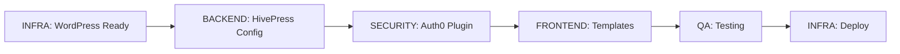

# Equipo de Agentes - Marketplace de Soluciones para Ciudades

## 1. Visión General

Este proyecto se implementará como un **sistema multi-agente**, donde cada agente tiene responsabilidades específicas y bien definidas. Esta estructura modular permite:

- ✅ Paralelización de tareas
- ✅ Especialización por dominio
- ✅ Fácil debugging (cada agente = módulo)
- ✅ Escalabilidad (agregar agentes si crece scope)

---

## 2. Estructura del Equipo

```
                    ┌──────────────┐
                    │  ARCHITECT   │ (Claude CTO)
                    │  (Orquestador)│
                    └──────┬───────┘
                           │
           ┌───────────────┼───────────────┐
           │               │               │
      ┌────▼────┐    ┌────▼────┐    ┌────▼────┐
      │ INFRA   │    │ BACKEND │    │FRONTEND │
      │ AGENT   │    │ AGENT   │    │ AGENT   │
      └────┬────┘    └────┬────┘    └────┬────┘
           │               │               │
           │          ┌────▼────┐          │
           │          │SECURITY │          │
           │          │ AGENT   │          │
           │          └────┬────┘          │
           │               │               │
           └───────────────┼───────────────┘
                           │
                      ┌────▼────┐
                      │   QA    │
                      │  AGENT  │
                      └─────────┘
```

---

## 3. Definición de Agentes

### 3.1 ARCHITECT (Orquestador)
**Rol:** Product Owner + Tech Lead
**Responsabilidades:**
- Definir arquitectura general
- Revisar y aprobar PRs conceptuales
- Coordinar entre agentes
- Resolver conflictos técnicos
- Mantener documentación actualizada

**Entregables:**
- ✅ REQUIREMENTS.md
- ✅ ARCHITECTURE.md
- ✅ PLAN.md
- ✅ AGENTS.md (este doc)

**Skills:**
- System design
- Project management
- Technical writing

---

### 3.2 INFRA AGENT (DevOps)
**Rol:** DevOps + Platform Engineer
**Responsabilidades:**
- Configurar Railway (MySQL, Volumes, Env Vars)
- Crear Dockerfile + docker-compose.yml
- Scripts de deployment (`entrypoint.sh`, etc.)
- CI/CD (GitHub Actions si aplica)
- Monitoreo y logging

**Tareas Asignadas:**
- [x] Fase 0: Setup inicial
- [x] Fase 1: WordPress base + Docker
- [ ] Fase 5: Performance optimization
- [ ] Fase 5: Deploy definitivo

**Entregables:**
- ✅ Dockerfile funcional
- ✅ Railway setup completo
- ✅ `scripts/entrypoint.sh`
- ✅ `docker-compose.yml` (local dev)
- ✅ `.env.example`
- ✅ `docs/DEPLOYMENT.md`

**Skills:**
- Docker
- Railway platform
- Bash scripting
- WP-CLI
- MySQL administration

**Dependencias:**
- Requiere credenciales Auth0 (de SECURITY AGENT)
- Requiere plugins instalados (de BACKEND AGENT)

---

### 3.3 BACKEND AGENT (WordPress Core)
**Rol:** Backend Developer
**Responsabilidades:**
- Configurar HivePress
- Crear campos custom
- Crear/configurar taxonomías (categorías)
- Scripts PHP (WP-CLI)
- Must-Use plugins
- Database schema

**Tareas Asignadas:**
- [x] Fase 2: HivePress + campos custom
- [ ] Fase 2: Crear categorías
- [ ] Fase 4: Lógica de badges (pending/published)
- [ ] Fase 5: Database optimization

**Entregables:**
- ✅ `scripts/install-plugins.sh`
- ✅ `scripts/configure-hivepress.php`
- ✅ `scripts/seed-categories.php`
- ✅ Campos custom registrados:
  - `linkedin_founders` (repeater, max 5)
  - `website` (URL, required)
  - `contact_email` (email, optional)
  - `phone` (text, optional)
- ✅ 5 categorías creadas (Movilidad, Espacio Público, Fintech, LegalIA, Datos)

**Skills:**
- PHP (WordPress standards)
- HivePress API
- WP-CLI
- MySQL queries
- Custom Post Types

**Dependencias:**
- Requiere WordPress base instalado (de INFRA AGENT)

---

### 3.4 SECURITY AGENT (Auth0 Integration)
**Rol:** Security Engineer
**Responsabilidades:**
- Integración Auth0
- Plugin custom `hivepress-auth0`
- OAuth 2.0 flow
- User sync (Auth0 → WordPress)
- Roles y capabilities
- Secrets management

**Tareas Asignadas:**
- [x] Fase 3: Auth0 integration completa
- [ ] Fase 5: Security audit

**Entregables:**
- ✅ Plugin `wp-content/plugins/hivepress-auth0/`
  - `hivepress-auth0.php`
  - `includes/class-auth0-client.php`
  - `includes/class-user-manager.php`
  - `includes/class-login-handler.php`
- ✅ Auto-creación de usuarios (role: Contributor)
- ✅ Metadata `auth0_id` sincronizado
- ✅ Desactivación de registro nativo
- ✅ Documentación de env vars requeridas

**Skills:**
- OAuth 2.0 / OIDC
- Auth0 platform
- WordPress user management
- JWT validation
- PHP security best practices

**Dependencias:**
- Requiere WordPress base (de INFRA AGENT)
- Requiere Auth0 tenant configurado (prerequisito)

---

### 3.5 FRONTEND AGENT (UI/UX)
**Rol:** Frontend Developer + Designer
**Responsabilidades:**
- Child theme customizado
- Templates de HivePress
- CSS (colores azul marino)
- Responsive design
- UX de formularios
- Traducción (i18n)

**Tareas Asignadas:**
- [x] Fase 2: Child theme base
- [x] Fase 4: Templates custom (home, detalle, cards)
- [ ] Fase 4: Polylang setup + traducción
- [ ] Fase 4: Página "Sobre Nosotros"
- [ ] Fase 5: Responsive testing

**Entregables:**
- ✅ Child theme `wp-content/themes/hivepress-child/`
  - `style.css` (colores #0A2463)
  - `functions.php`
  - `templates/home.php`
  - `templates/listing/view/listing-card.php`
  - `templates/listing/view/single-listing.php`
  - `templates/listing/view/listing-badge.php`
- ✅ CSS responsive (mobile-first)
- ✅ Translation files (ES/EN)
- ✅ Buscador integrado
- ✅ Botones de categorías

**Skills:**
- PHP templating
- CSS/SCSS
- Responsive design
- HivePress template system
- i18n/l10n (Polylang)
- UX principles

**Dependencias:**
- Requiere HivePress instalado (de BACKEND AGENT)
- Requiere categorías creadas (de BACKEND AGENT)

---

### 3.6 QA AGENT (Testing & Quality)
**Rol:** QA Engineer
**Responsabilidades:**
- Testing E2E manual
- Validación de user flows
- Performance testing
- Accessibility audit
- Regression testing
- Bug reporting

**Tareas Asignadas:**
- [ ] Fase 5: Testing completo (checklist)
- [ ] Fase 5: Performance validation
- [ ] Fase 5: Cross-browser testing

**Entregables:**
- ✅ Test plan documentado
- ✅ Bug reports (GitHub Issues)
- ✅ Performance report (Lighthouse)
- ✅ Accessibility report (WCAG 2.1 AA)
- ✅ Sign-off para producción

**Skills:**
- Manual testing
- Test case design
- Browser DevTools
- Lighthouse
- WCAG guidelines

**Dependencias:**
- Requiere todos los componentes integrados
- Ambiente de staging funcional

---

## 4. Matriz de Responsabilidades (RACI)

| Tarea | Architect | Infra | Backend | Security | Frontend | QA |
|-------|-----------|-------|---------|----------|----------|-----|
| **Documentación** | R/A | C | C | C | C | I |
| **Dockerfile** | C | R/A | I | I | I | I |
| **Railway setup** | A | R | I | I | I | I |
| **WordPress install** | A | R | C | I | I | I |
| **HivePress config** | C | I | R/A | I | C | I |
| **Auth0 plugin** | C | I | I | R/A | I | I |
| **Child theme** | C | I | C | I | R/A | I |
| **Testing E2E** | A | I | I | I | I | R |
| **Deploy producción** | A | R | I | I | I | C |

**Leyenda:**
- **R** = Responsible (ejecuta)
- **A** = Accountable (aprueba)
- **C** = Consulted (consultado)
- **I** = Informed (informado)

---

## 5. Canales de Comunicación

### 5.1 Documentos Compartidos
- **Requisitos:** `docs/REQUIREMENTS.md` (single source of truth)
- **Arquitectura:** `docs/ARCHITECTURE.md`
- **Plan:** `docs/PLAN.md`

### 5.2 Handoffs Entre Agentes



**Criterios de Handoff:**

| De → A | Criterio de Aceptación |
|--------|------------------------|
| INFRA → BACKEND | WordPress accesible en Railway, MySQL conectado |
| BACKEND → SECURITY | HivePress activado, campos custom registrados |
| SECURITY → FRONTEND | Auth0 login funcional, usuarios crean OK |
| FRONTEND → QA | Todos los templates renderizando, CSS aplicado |
| QA → INFRA | Todos los tests pasan, performance OK |

---

## 6. Workflow Diario (Ejemplo)

### Morning Standup (Async)
Cada agente reporta en formato:
1. **Yesterday:** ¿Qué completé?
2. **Today:** ¿En qué trabajaré?
3. **Blockers:** ¿Qué me bloquea?

### Ejemplo:
```markdown
## BACKEND AGENT - Day 2

**Yesterday:**
- ✅ Instalé HivePress vía WP-CLI
- ✅ Creé script configure-hivepress.php
- ⚠️ Campo repeater de Founders dio error (investigando)

**Today:**
- [ ] Fix repeater field issue
- [ ] Crear 5 categorías con seed-categories.php
- [ ] Documentar custom fields en README

**Blockers:**
- Ninguno
```

---

## 7. Escalation Path

### Decisiones Técnicas Bloqueantes
1. Agente identifica blocker
2. Consulta con ARCHITECT
3. ARCHITECT decide o escala a "steering committee" (user/stakeholder)

### Conflictos Entre Agentes
Ejemplo: FRONTEND quiere cambiar estructura de datos que BACKEND ya implementó.

**Proceso:**
1. FRONTEND reporta a ARCHITECT
2. ARCHITECT convoca a ambos agentes
3. Se evalúa impacto (tiempo, complejidad)
4. ARCHITECT decide (basado en REQUIREMENTS.md)

---

## 8. Métricas de Éxito por Agente

### INFRA AGENT
- ✅ Uptime Railway > 99%
- ✅ Deploy time < 5 minutos
- ✅ Zero downtime deploys

### BACKEND AGENT
- ✅ 100% campos custom funcionando
- ✅ 0 errores PHP en logs
- ✅ Queries optimizadas (< 100ms)

### SECURITY AGENT
- ✅ 100% usuarios crean vía Auth0
- ✅ 0 usuarios nativos (excepto admin)
- ✅ Zero vulnerabilidades en audit

### FRONTEND AGENT
- ✅ Lighthouse Performance > 80
- ✅ Mobile responsive (320px+)
- ✅ WCAG 2.1 AA compliance

### QA AGENT
- ✅ 100% test cases ejecutados
- ✅ 0 critical bugs en producción
- ✅ Performance targets met

---

## 9. Onboarding de Nuevos Agentes

Si el proyecto crece, podemos agregar:

### Posibles Agentes Futuros:
1. **DATA AGENT** - Analytics, métricas, dashboards
2. **EMAIL AGENT** - Transactional emails (SendGrid)
3. **API AGENT** - REST API pública
4. **MOBILE AGENT** - React Native app
5. **MARKETING AGENT** - SEO, content strategy

**Proceso de Onboarding:**
1. Leer `REQUIREMENTS.md`, `ARCHITECTURE.md`, `PLAN.md`
2. Review de código existente
3. Sesión con ARCHITECT (Q&A)
4. Asignación de primera tarea (pequeña)

---

## 10. Postmortem Process

Al final de cada fase, los agentes involucrados hacen retrospectiva:

### Template:
```markdown
## Fase X Retrospective

**What went well:**
- [Item 1]

**What could improve:**
- [Item 1]

**Action items:**
- [Item 1] - Responsable: [AGENT]
```

Ejemplo:
```markdown
## Fase 3 Retrospective (Auth0)

**What went well:**
- Plugin custom funcionó a la primera
- Documentación de Auth0 muy clara

**What could improve:**
- Testing en local con ngrok hubiera ahorrado tiempo
- Faltó validación de email duplicados

**Action items:**
- Agregar check de email único - Responsable: SECURITY AGENT
- Documentar setup de ngrok - Responsable: INFRA AGENT
```

---

## 11. Knowledge Base

Cada agente mantiene un mini-wiki:

```
docs/
├── agents/
│   ├── infra-knowledge.md      # Railway tips, Docker tricks
│   ├── backend-knowledge.md    # HivePress snippets, WP-CLI commands
│   ├── security-knowledge.md   # Auth0 troubleshooting
│   ├── frontend-knowledge.md   # CSS patterns, template overrides
│   └── qa-knowledge.md         # Test cases, performance baselines
```

---

## 12. Agente "On Call"

Para producción, rotación semanal:

| Semana | Agente On-Call | Backup |
|--------|----------------|---------|
| 1 | INFRA | BACKEND |
| 2 | SECURITY | INFRA |
| 3 | FRONTEND | SECURITY |
| 4 | BACKEND | FRONTEND |

**Responsabilidades On-Call:**
- Responder a incidentes (< 1 hora)
- Revisar logs diarios
- Aplicar hotfixes si necesario

---

## 13. Herramientas por Agente

| Agente | Herramientas Principales |
|--------|--------------------------|
| **INFRA** | Railway CLI, Docker, WP-CLI, MySQL Workbench |
| **BACKEND** | WP-CLI, PHP Storm, Postman, Sequel Pro |
| **SECURITY** | Auth0 Dashboard, JWT.io, Burp Suite (testing) |
| **FRONTEND** | VS Code, Browser DevTools, Figma, Polylang |
| **QA** | Lighthouse, BrowserStack, Postman, Jira |

---

## 14. Success Stories Template

Al completar cada fase, documentar en `docs/SUCCESS_STORIES.md`:

```markdown
## Fase X: [Nombre]

**Agente(s):** [AGENT]
**Challenge:** [Problema técnico]
**Solution:** [Cómo se resolvió]
**Impact:** [Resultados]
**Lessons learned:** [Aprendizajes]
```

---

## 15. Agent Skills Matrix

| Skill | INFRA | BACKEND | SECURITY | FRONTEND | QA |
|-------|-------|---------|----------|----------|-----|
| **Docker** | Expert | Basic | Basic | Basic | Basic |
| **PHP** | Intermediate | Expert | Expert | Intermediate | Basic |
| **JavaScript** | Basic | Basic | Basic | Expert | Intermediate |
| **WordPress** | Intermediate | Expert | Expert | Expert | Intermediate |
| **OAuth 2.0** | Basic | Basic | Expert | Basic | Basic |
| **CSS** | Basic | Basic | Basic | Expert | Intermediate |
| **MySQL** | Expert | Intermediate | Basic | Basic | Basic |
| **Testing** | Intermediate | Intermediate | Intermediate | Intermediate | Expert |

---

## 16. Next Steps

### Para Iniciar el Proyecto:

1. **ARCHITECT** (Claude):
   - ✅ Crear documentación base
   - [ ] Validar con stakeholder (user)
   - [ ] Dar kickoff a INFRA AGENT

2. **INFRA AGENT**:
   - [ ] Setup Railway (Fase 0)
   - [ ] Dockerfile (Fase 1)
   - [ ] Handoff a BACKEND AGENT

3. **BACKEND AGENT**:
   - [ ] Esperar handoff de INFRA
   - [ ] Ejecutar Fase 2

4. **Continuar según PLAN.md...**

---

## 17. Contact Matrix

| Agente | "GitHub Handle" | Expertise Areas |
|--------|-----------------|-----------------|
| ARCHITECT | @claude-cto | Architecture, PM |
| INFRA | @infra-agent | Railway, Docker, DevOps |
| BACKEND | @backend-agent | HivePress, PHP, WP-CLI |
| SECURITY | @security-agent | Auth0, OAuth, Security |
| FRONTEND | @frontend-agent | React, CSS, UX |
| QA | @qa-agent | Testing, Performance |

*(Esto es simbólico - en realidad todos somos Claude ejecutando diferentes roles)*

---

**Estado:** Equipo definido ✅
**Siguiente paso:** User validation → Kickoff Fase 0 🚀
